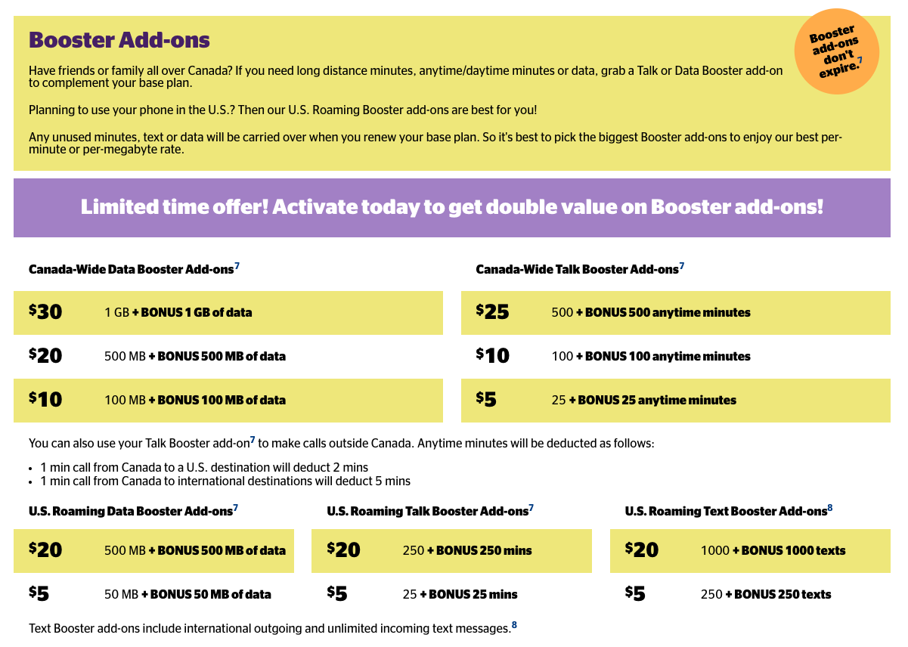

# Koodo Scraper

A simple scraper to check for promotions in [Koodo prepaid plans](https://www.koodomobile.com/prepaid-plans), where data and minute boosters are occasionally doubled or tripled (only a few times per year in my experience). This will check HTML divs with class `.add-on-title` and see if "bonus" is found. (Hopefully this is a good strategy—it’s untested at the moment as I’m waiting for another promo such as this screenshot from 2017-12-07 to check the HTML.)

Based on: https://aaronvb.com/articles/simple-website-text-scraping-with-go-and-aws-lambda.



## Build

```
$ GOOS=linux GOARCH=amd64 go build -o main scraper.go
$ zip main.zip main
```

## Deploy

Upload the zip file and ensure the handler is set to `main`.

### Environment Variables

Set these in AWS Lambda:

```
RECIPIENT=
SENDER=
SES_LOCATION=
```

Ensure sender/recipient addresses exist in SES and are verified. The lambda execution role will also require SES permission.

### Automation

Using AWS EventBridge, I set a rule to run this Lambda function every day, with the following input (Constant [JSON text]):

```
{   "url": "https://www.koodomobile.com/prepaid-plans",   "words": "bonus" }
```

To schedule the time of day you want it to run, use a cron expression such as `00 13 * * ? *` (13:00 GMT, or 6 AM in my timezone, PDT).

The scraper should not exceed the free tier of Lambda functions. Event Buses in EventBridge are probably free as well, though it isn’t clear to me if these are “default service events” or custom events (the latter might cost a fraction of a cent per month).

## Why?

First, see my article [How to Minimize Your Phone Bill](https://russellmcwhae.ca/journal/minimize-cell-phone).

The idea here is to stock up on prepaid add-ons when they are double or triple their standard amounts. Automating this via a scraper means not having to manually check the page at (ir)regular intervals. The actual dollar savings in doing this likely will not exceed a hundred dollars a year, but it was a fun project to learn Go and AWS Lambda functions.
